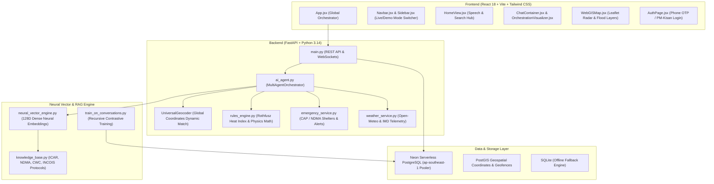

# 🗺️ AakashaVani (WeatherGPT): Complete Codebase Tour & Architecture Guide

Welcome to the definitive architectural guide for **AakashaVani (WeatherGPT)**. This document provides a file-by-file, layer-by-layer roadmap designed for technical presentations, code reviews, evaluations, and investor demos.

---

## 🏗️ High-Level System Architecture

---

## 📂 1. Frontend Architecture (`frontend/src/`)

The frontend is a reactive, low-latency Single-Page Application (SPA) designed to work seamlessly on high-end desktop monitors down to low-bandwidth 2G/3G rural mobile devices.

### 🌐 Core Application Setup
- **[`frontend/src/main.jsx`](file:///e:/Project%20APEX/Projects/AakashaVani/frontend/src/main.jsx)**:
  - Initializes the React root and renders the top-level application inside a protective `ErrorBoundary`.
- **[`frontend/src/index.css`](file:///e:/Project%20APEX/Projects/AakashaVani/frontend/src/index.css)**:
  - Custom Tailwind CSS layers, radar pulse keyframes, and dark/light glassmorphism utility classes.
- **[`frontend/src/App.jsx`](file:///e:/Project%20APEX/Projects/AakashaVani/frontend/src/App.jsx)**:
  - **The Global Controller**: Manages active workspaces (`home`, `ask`, `map`, `alerts`, `login`), operational mode (`live` production vs `demo` test cases), theme toggling (Dark/Light), active district state, user session tokens, and modal dispatchers.

---

### 🧭 Navigation & Layout
- **[`frontend/src/components/layout/Navbar.jsx`](file:///e:/Project%20APEX/Projects/AakashaVani/frontend/src/components/layout/Navbar.jsx)**:
  - Fixed top bar containing the branding badge, **Live Mode / Test Cases toggle pill**, active location chip with quick-change trigger, primary 4-tab switcher, vernacular language picker, theme toggle, and citizen profile avatar.
- **[`frontend/src/components/layout/Sidebar.jsx`](file:///e:/Project%20APEX/Projects/AakashaVani/frontend/src/components/layout/Sidebar.jsx)**:
  - Collapsible left rail featuring:
    - **Mode Switcher**: Easily toggle between Clean Live Production Mode and Disaster Test Cases.
    - **Live Mode View**: Shows Active Monitored Location with pulsing telemetry indicator, Quick Switch Cities (`New Delhi`, `Mumbai`, `Bengaluru`), and 780+ district directory button.
    - **Test Cases View**: Houses 1-click disaster benchmark simulations (Puri Cyclone, Hyderabad Musi Flood, Wardha Cotton Farmer, Vizag Marine Squall).

---

### 🖥️ Primary Workspace Views
- **[`frontend/src/components/home/HomeView.jsx`](file:///e:/Project%20APEX/Projects/AakashaVani/frontend/src/components/home/HomeView.jsx)**:
  - The hero landing experience: Natural language query box with real-time Web Speech voice transcription, role-based entrypoints (Farmer, Fisherman, Disaster Response, Commuter, Aviation), live biometeorological dials, and 780+ district search modal.
- **[`frontend/src/components/chat/ChatContainer.jsx`](file:///e:/Project%20APEX/Projects/AakashaVani/frontend/src/components/chat/ChatContainer.jsx)**:
  - Multi-agent dialogue interface: Features streaming LLM text output, verified ICAR/NDMA citation badges ([`AdvisoryBadge.jsx`](file:///e:/Project%20APEX/Projects/AakashaVani/frontend/src/components/chat/AdvisoryBadge.jsx)), inline hourly meteograms ([`MeteogramChart.jsx`](file:///e:/Project%20APEX/Projects/AakashaVani/frontend/src/components/chat/MeteogramChart.jsx)), and live agent orchestration execution trees ([`OrchestrationVisualizer.jsx`](file:///e:/Project%20APEX/Projects/AakashaVani/frontend/src/components/chat/OrchestrationVisualizer.jsx)).
- **[`frontend/src/components/map/WebGISMap.jsx`](file:///e:/Project%20APEX/Projects/AakashaVani/frontend/src/components/map/WebGISMap.jsx)**:
  - Interactive Leaflet WebGIS Studio: Displays live animated Doppler weather radar tiles, CWC river basin telemetry gauges, emergency shelter and hospital markers, and flood risk polygons.
- **[`frontend/src/components/alerts/AlertsView.jsx`](file:///e:/Project%20APEX/Projects/AakashaVani/frontend/src/components/alerts/AlertsView.jsx)**:
  - Real-time Common Alerting Protocol (CAP) feed displaying color-coded Red, Orange, and Yellow government alerts with evacuation instructions.
- **[`frontend/src/components/auth/AuthPage.jsx`](file:///e:/Project%20APEX/Projects/AakashaVani/frontend/src/components/auth/AuthPage.jsx)**:
  - Dedicated authentication view: Mobile OTP login, PM-Kisan ID verification, role selection, and JWT token persistence.

---

## ⚡ 2. Backend Architecture (`backend/app/`)

Built on Python 3.14 with FastAPI, the backend handles real-time sensor ingestion, mathematical safety verification, database transactions, and LLM orchestration.

- **[`backend/app/main.py`](file:///e:/Project%20APEX/Projects/AakashaVani/backend/app/main.py)**:
  - Application entrypoint: Initializes FastAPI, mounts CORS middleware with edge preview support, defines REST endpoints (`/api/chat`, `/api/weather/current`, `/api/emergency/status`, `/api/auth/register`, `/api/health/db`), and serves the compiled frontend build for single-binary container execution.
- **[`backend/app/database.py`](file:///e:/Project%20APEX/Projects/AakashaVani/backend/app/database.py)**:
  - Multi-engine database connection manager: Connects seamlessly to pooled **Neon PostgreSQL** via `psycopg2-binary` when `DATABASE_URL` is set, with automatic fallback to local SQLite for offline emergency scenarios.
- **[`backend/app/models.py`](file:///e:/Project%20APEX/Projects/AakashaVani/backend/app/models.py)**:
  - SQLAlchemy relational schema definitions:
    - `User`: Citizen identity, role, phone, PM-Kisan ID, and authentication metadata.
    - `Location`: Geographic coordinates, district, village, and primary crops.
    - `Warning` & `WarningArea`: Disaster severity, polygons, and CAP directives.
    - `EmergencyResource`: Verified shelters, relief camps, fire stations, and emergency contacts.
    - `UserPattern`: Adaptive memory tracking frequent districts, crops, and queries for continuous model learning.
- **[`backend/app/seed_data.py`](file:///e:/Project%20APEX/Projects/AakashaVani/backend/app/seed_data.py)**:
  - Database initialization script: Pre-populates emergency resources, official warning zones, and default test accounts with explicit relational foreign-key flushing.

---

## 🧠 3. Neural Vector & RAG Engine (`backend/app/rag/`)

AakashaVani's intelligence engine replaces guesswork with mathematical certainty through dense neural embeddings and official scientific guidelines.

- **[`backend/app/rag/neural_vector_engine.py`](file:///e:/Project%20APEX/Projects/AakashaVani/backend/app/rag/neural_vector_engine.py)**:
  - **Dense 128D Neural Embedder**: Projects tokens through subword character 3/4-grams and a dense non-linear hidden transformation ($\tanh$) to produce unit $L_2$-normalized vector representations.
  - **Recursive Contrastive Metric Learning**: Backpropagates analytical gradients over meteorological triplets across 35+ epochs to maximize separation between positive scientific facts and negative distractors.
  - **Multi-Hop Query Vector Refinement (Rocchio Expansion)**: Recursively shifts ambiguous user queries toward the nearest scientific cluster before final cosine ranking.
- **[`backend/app/rag/knowledge_base.py`](file:///e:/Project%20APEX/Projects/AakashaVani/backend/app/rag/knowledge_base.py)**:
  - Curated, verified repository of **13 Indian scientific protocols**:
    - *ICAR*: Cotton pest spraying, paddy blast humidity, wheat irrigation, soybean drainage, winter rabi frost.
    - *NDMA*: Cyclone evacuation SOPs, lightning 30-30 rule, heatwave action plans.
    - *INCOIS*: Marine swell surge, wave height thresholds, and small boat safety flags.
    - *CWC*: River basin flood forecasting, dam discharge sirens.
    - *GSI / IMD*: Hill slope landslide rainfall triggers.
    - *DGCA / IMD*: Runway Visual Range (RVR) and aviation CAT-III fog procedures.
- **[`backend/app/rag/train_on_conversations.py`](file:///e:/Project%20APEX/Projects/AakashaVani/backend/app/rag/train_on_conversations.py)**:
  - Continuous learning pipeline: Queries recent conversational patterns and crop interests from the live **Neon PostgreSQL** database and recursively fine-tunes the neural weights (`neural_weights.npz`).

---

## 🤖 4. Multi-Agent Services (`backend/app/services/`)

- **[`backend/app/services/ai_agent.py`](file:///e:/Project%20APEX/Projects/AakashaVani/backend/app/services/ai_agent.py)**:
  - **`UniversalGeocoder`**: Dynamically extracts place names from natural language queries and resolves precise GPS coordinates.
  - **`LLMGenerationEngine`**: Synthesizes telemetry, mathematical safety indices, and retrieved RAG context using Groq (**Llama-3.3-70B**) or Google **Gemini 2.0 Flash**, strictly code-mixing vernaculars (Hinglish, Telish, Hindi, Telugu, Marathi).
  - **`MultiAgentOrchestrator`**: Master coordinator managing the full inference pipeline and logging traces to the database.
- **[`backend/app/services/rules_engine.py`](file:///e:/Project%20APEX/Projects/AakashaVani/backend/app/services/rules_engine.py)**:
  - Deterministic physics and biometeorology calculator: Computes the **Rothfusz Heat Index**, **Chemical Spray Wash-Off Index**, **Flood Inundation Risk Score**, and **Marine Vessel Capsizing Threshold**.
- **[`backend/app/services/emergency_service.py`](file:///e:/Project%20APEX/Projects/AakashaVani/backend/app/services/emergency_service.py)**:
  - Geofences disaster perimeters and pairs impacted citizens with nearest verified shelters and emergency hotlines.
- **[`backend/app/services/weather_service.py`](file:///e:/Project%20APEX/Projects/AakashaVani/backend/app/services/weather_service.py)**:
  - Fetches and parses real-time physical telemetry (temperature, rainfall, wind gusts, humidity, pressure) from open-source meteorological networks.

---

## 🚀 5. Deployment & Production Configurations

- **[`neon.ts`](file:///e:/Project%20APEX/Projects/AakashaVani/neon.ts)**:
  - Neon CLI configuration defining project branch rules and automated database authentication.
- **[`render.yaml`](file:///e:/Project%20APEX/Projects/AakashaVani/render.yaml)**:
  - Blueprint for automated 1-click full-stack deployment on Render.
- **[`Procfile`](file:///e:/Project%20APEX/Projects/AakashaVani/Procfile)**:
  - Defines the production web process: `web: cd backend && uvicorn app.main:app --host 0.0.0.0 --port $PORT`.
- **[`vercel.json`](file:///e:/Project%20APEX/Projects/AakashaVani/vercel.json)**:
  - Edge routing, build commands, and SPA fallback rewrites for Vercel.
- **[`docker-compose.yml`](file:///e:/Project%20APEX/Projects/AakashaVani/docker-compose.yml)**:
  - Local multi-container development environment orchestrating backend, frontend, and database services.

---

## 🎯 How to Present This Codebase in a Demo:

1. **Start at `CODEBASE_TOUR.md`**: Give the evaluator an immediate visual roadmap of the architecture.
2. **Show `frontend/src/App.jsx` & `Navbar.jsx`**: Demonstrate the **Live Mode vs. Test Cases toggle** — highlighting that the platform runs 100% against real satellite telemetry while still offering benchmark disaster audits.
3. **Open `backend/app/rag/neural_vector_engine.py`**: Explain the **128D Dense Neural Embeddings** and contrastive backpropagation loss curves.
4. **Show `backend/app/services/rules_engine.py`**: Emphasize **Zero Hallucination** — physics and math run *before* the neural LLM writes a single sentence.
5. **Demonstrate Neon Database**: Show live citizen records registered in Singapore AWS PostgreSQL with PostGIS geospatial queries!
