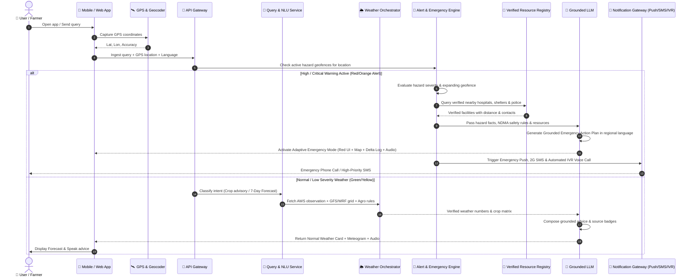
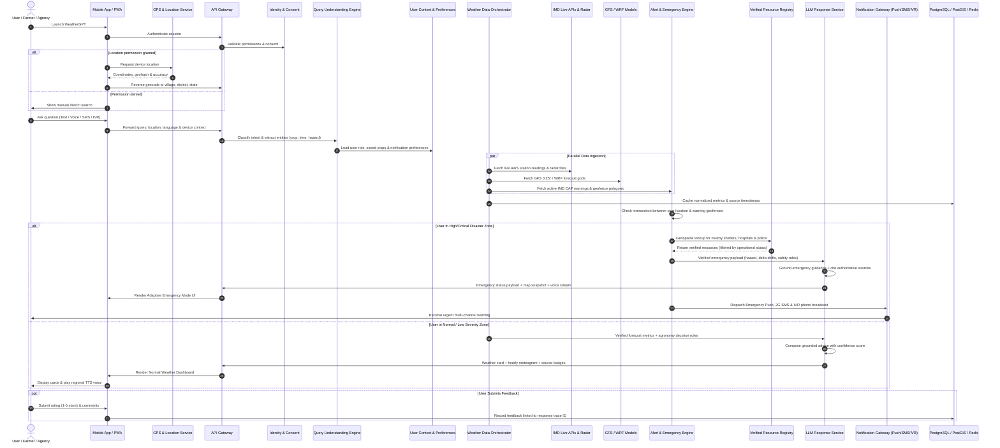
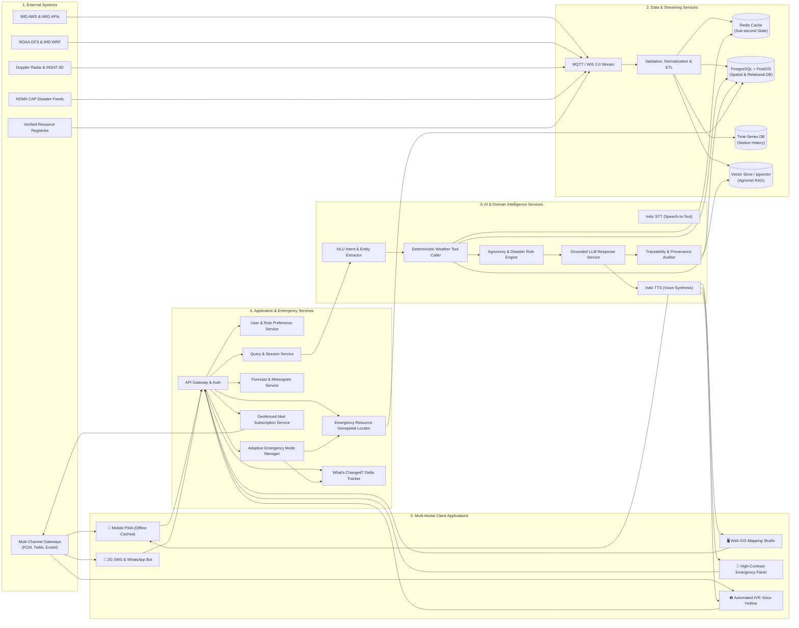
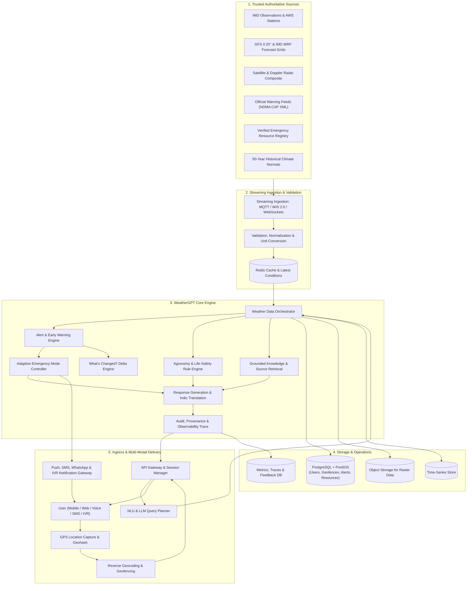
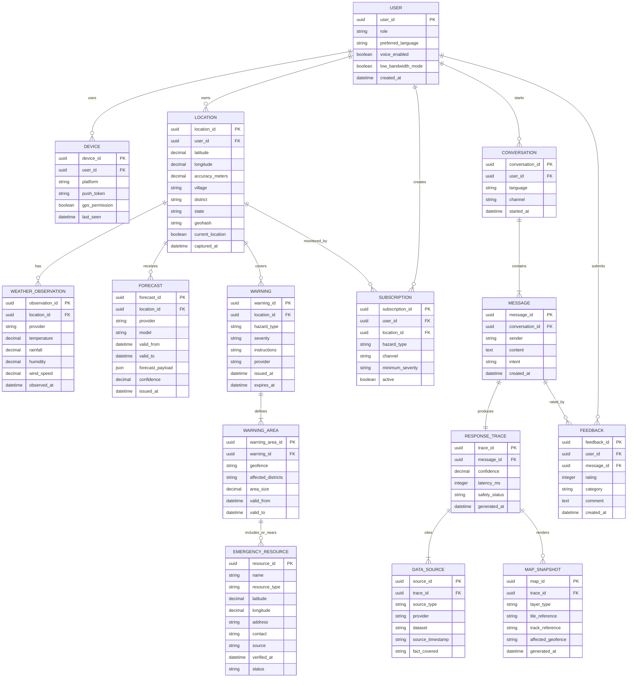
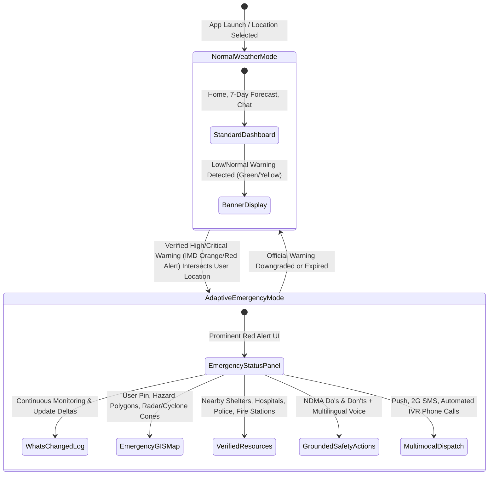
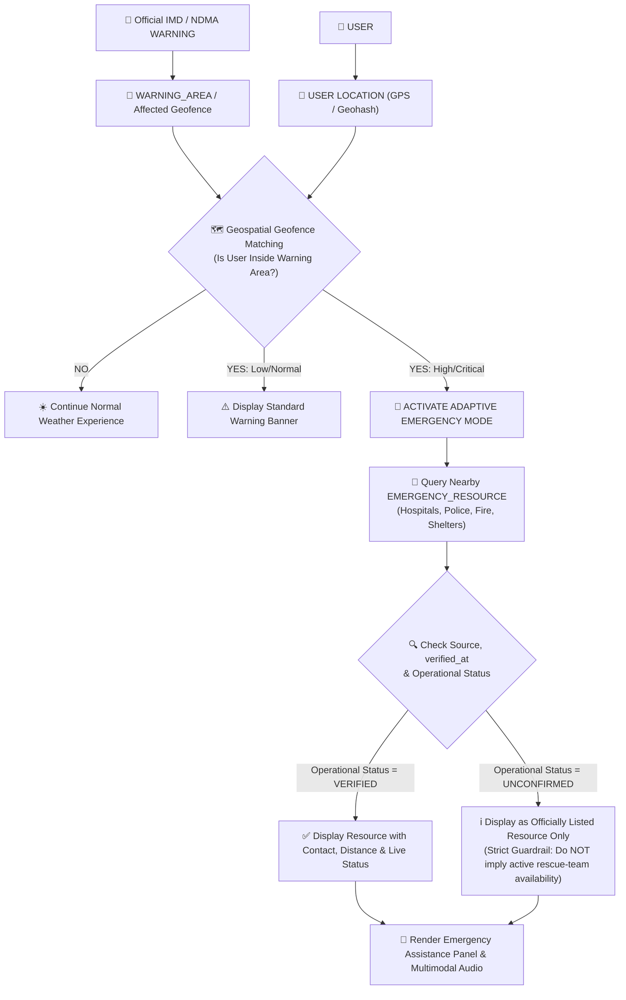

# 🌦️ AakashaVani (WeatherGPT) — Complete Architecture & Diagram Master

Every diagram below is updated with:
1. **Adaptive Emergency Mode** (Automatic trigger on High/Critical IMD Red/Orange alerts)
2. **Verified Emergency Resources Locator** (Hospitals, Police, Fire, Shelters, Helplines with strict verification guardrails)
3. **"What's Changed?" Situational Delta Engine**
4. **Low-Bandwidth / 2G Offline SMS & IVR Telephony Fallback**
5. **Full 15-Table Relational & Geospatial Schema (`WARNING_AREA`, `EMERGENCY_RESOURCE`, `MAP_SNAPSHOT`)**

---

## 📊 Diagram 1: End-to-End User & Emergency Flow Sequence

---

## ⚙️ Diagram 2: Extended Technical Execution Lifecycle (All Systems)

---

## 🏛️ Diagram 3: High-Level System Architecture & Services (5 Tiers)

---

## 🌊 Diagram 4: Detailed Component & Data Flow Architecture

---

## 🗄️ Diagram 5: Complete Database Entity-Relationship Diagram (15 Tables)

---

## 🚨 Diagram 6: Adaptive Emergency Mode State Machine

---

## 🏥 Diagram 7: Emergency Resource Geospatial Workflow

